### 1. Создание каталога проекта

Перед началом работы над этим проектом, проверье другие запущенные у вас **docker-compose** приложения:
```shell
docker compose ls
```

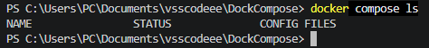

их лучше остановить, чтобы снизить риск возникновения конфликтов использования портов!

Структура проекта
```
wordpress/
└──compose.yaml
```

Структуру проекта можно сделать одной **bash**-командой, которая автоматически создаст все файлы и каталоги проекта:
```shell
mkdir -p wordpress && touch wordpress/compose.yaml && cd wordpress
```

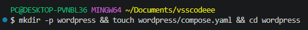

### 2. Содержимое файла конфигурации `compose.yaml` (или `docker-compose.yml` для совместимости со старыми версиями Docker Compose)
```yaml
#version: '3.9' # Современные версии могут не требовать эту строку
services:
  # Сервис базы данных
  db:
    # Используем официальный образ MySQL 8.0
    image: mysql:8.0
    # Контейнер всегда будет перезапускаться, если остановится
    restart: unless-stopped
    environment:
      # Обязательные переменные для MySQL
      MYSQL_ROOT_PASSWORD: somewordpress
      MYSQL_DATABASE: wordpress
      MYSQL_USER: wordpress
      MYSQL_PASSWORD: wordpress
    volumes:
      # Сохраняем данные базы данных в Docker-томе
      - db_data:/var/lib/mysql
    networks:
      - wp-network

  # Сервис WordPress
  wordpress:
    # Зависит от сервиса db, будет запущен после него
    depends_on:
      - db
    # Используем официальный образ WordPress с Apache
    image: wordpress:latest
    # Пробрасываем порт 8080 на хосте на порт 80 в контейнере
    ports:
      - "8081:80"
    restart: unless-stopped
    environment:
      # Переменные для подключения к базе данных
      WORDPRESS_DB_HOST: db:3306
      WORDPRESS_DB_USER: wordpress
      WORDPRESS_DB_PASSWORD: wordpress
      WORDPRESS_DB_NAME: wordpress
    volumes:
      # Сохраняем файлы плагинов, тем и загрузок
      - wordpress_data:/var/www/html
    networks:
      - wp-network

# Определяем сеть для связи контейнеров
networks:
  wp-network:

# Определяем тома для сохранения данных
volumes:
  db_data:
  wordpress_data:
```

**Что делает этот файл?**
- `services:` Определяет два контейнера: db для MySQL и wordpress для самого движка.
- `depends_on:` Указывает, что контейнер wordpress должен запускаться после db.
- `ports:` Пробрасывает порт 80 из контейнера WordPress на порт 8081 вашего компьютера. Вы можете изменить внешний порт, например, на 8000:80, если порт 8081 уже занят.
- `environment:` Передаёт внутрь контейнеров переменные окружения. Для MySQL это настройки базы данных, для WordPress — параметры подключения к ней.
- `volumes (тома):` Создаёт специальные области на вашем жёстком диске, которые существуют отдельно от контейнеров. Это гарантирует, что даже после удаления контейнеров ваши файлы и записи в базе данных не пропадут. Том db_data сохраняет базу данных, а wordpress_data — содержимое папки wp-content (плагины, темы, загрузки).

### 3. Установка и запуск проекта

В папке, где находится ваш `compose.yaml` файл выполните команду для запуска всех сервисов в фоновом режиме:
```shell
docker compose up -d
```

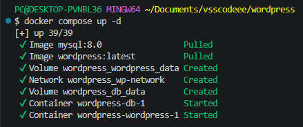

**Docker** начнёт скачивать необходимые образы и запускать контейнеры. Этот шаг может занять несколько минут.

параметр `-d` означает фоновый режим запуска контейнеров

Дождитесь полной загрузки. Убедиться, что всё работает, можно командой:
```shell
docker compose ps -a
```

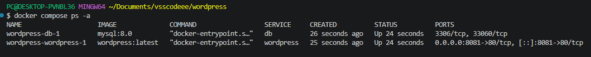

Оба контейнера (`wordpress` и `db`) должны иметь статус **Up**.

### 4. Запустить установку WP-приложения в браузере

[Откройте в браузере адрес: http://localhost:8081](http://localhost:8081)

Укажите системe **WP** логин, например `user`, и сохраните предложенный пароль. Выполните установку **WP** и войдите в админ-панель. Из админ-панели откройте сайт.


### 5. Управление и полезные команды

Находясь в папке `wordpress`

1. Просмотр логов приложения **WP** в реальном времени
```shell
docker compose logs -f wordpress
```

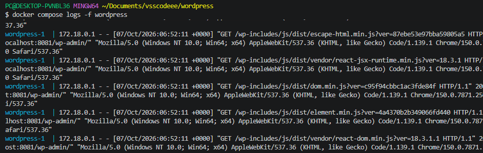

`-f` в режиме ожидания (в режиме реального времени)

Чтобы выйти из режима просмотра логов, необходимо выполнить `Ctrl+C` в терминале

2. Просмотр логов базы данных **db** в реальном времени
```shell
docker compose logs -f db
```

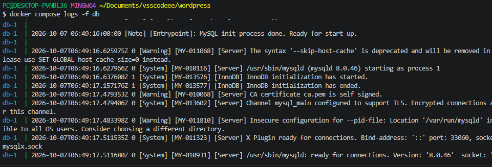

Чтобы выйти из режима просмотра логов, необходимо выполнить `Ctrl+C` в терминале

3. Приостановить запущенный контейнер:
```shell
docker compose stop
```

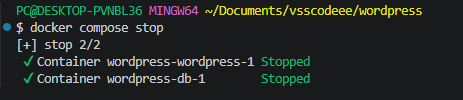

4. Запустить приостановленный контейнер:
```shell
docker compose start
```

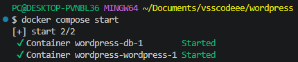

5. Перезапустить
```shell
docker compose restart
```

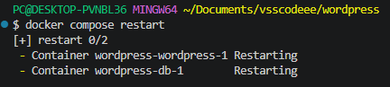

6. Показать конфигурацию текущего проекта:
```shell
docker compose config
```

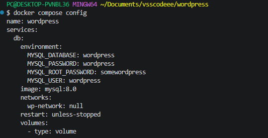

### 6. Удаление этого проекта

Находясь в папке `wordpress`

1. Остановка контейнеров этого проекта:
```shell
docker compose down
```

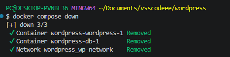

2. Остановка с полным удалением всех данных (базы данных и файлов) - опционально:
```shell
docker compose down --volumes
```

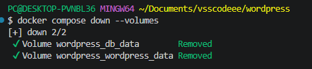

или для краткости:
```shell
docker compose down -v
```
(**Будьте осторожны:** эта команда удалит всё, что вы создали на сайте Word Press!).

> ### Для полного удаления этого проекта, достаточно остановить его через `docker compose down` или `docker compose down --volumes`, удалить docker-образ, после чего удалить каталог проекта `wordpress`

Выходим из каталога проекта
```shell
cd ..
```
и удаляем
```shell
rm -rf wordpress
```

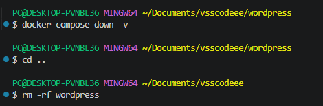