Перед началом работы над этим проектом, проверье другие запущенные у вас **docker-compose** приложения:
```shell
docker compose ls
```
их лучше остановить, чтобы снизить риск возникновения конфликтов использования портов!

### 1. Создание каталога проекта

Структура проекта
```
joomla-docker/
└── compose.yml
```

Создаём каталог проекта одной командой в Git-Bash
```shell
mkdir -p joomla-docker && touch joomla-docker/compose.yaml && cd joomla-docker
```

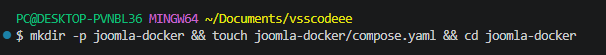

### 2. Содержимое файла конфигурации `compose.yaml` (или `docker-compose.yml` для совместимости со старыми версиями Docker Compose)

Создаём и редактируем файл настроек композера средствами **VS Code** или через **Git-Bash**
Версия 1
```yml
services:
  # Сервис базы данных MariaDB
  db:
    # Используем официальный образ MariaDB 11.5.2
    image: mariadb:11.5.2
    # Контейнер автоматически перезапускается, если он остановился или упал
    restart: unless-stopped
    environment:
      # Обязательные переменные окружения для базы данных
      MYSQL_ROOT_PASSWORD: example_root_password
      MYSQL_DATABASE: joomla_db
      MYSQL_USER: joomla_user
      MYSQL_PASSWORD: joomla_password
    volumes:
      # Сохраняем данные базы данных в Docker-томе для персистентности
      - db_data:/var/lib/mysql
    networks:
      - joomla-network

  # Сервис Joomla
  joomla:
    # Зависит от сервиса db, запустится только после того, как база данных будет готова
    depends_on:
      - db
    # Используем официальный образ Joomla с Apache
    image: joomla:latest
    # Пробрасываем порт 8082 на хосте на порт 82 в контейнере
    ports:
      - "8082:80"
    restart: unless-stopped
    environment:
      # Переменные окружения для подключения Joomla к базе данных
      JOOMLA_DB_HOST: db:3306
      JOOMLA_DB_USER: joomla_user
      JOOMLA_DB_PASSWORD: joomla_password
      JOOMLA_DB_NAME: joomla_db
    volumes:
      # Монтируем директорию с данными Joomla для сохранения контента, плагинов и тем
      - joomla_data:/var/www/html
    networks:
      - joomla-network

# Определяем общую сеть для связи контейнеров
networks:
  joomla-network:

# Определяем Docker-тома для хранения данных
volumes:
  db_data:
  joomla_data:
```

### 3. Установка и запуск проекта

Находясь в каталоге проекта `joomla-docker`, выполнить:

Запуск всех сервисов
```shell
docker compose up -d
```

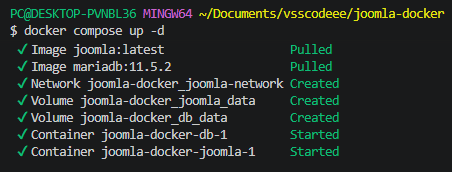

- `-d` - существует директория

Проверка статуса
```shell
docker compose ls
```

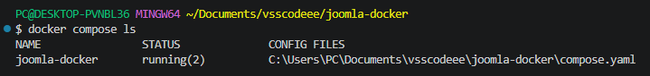

```shell
docker compose ps -a
```

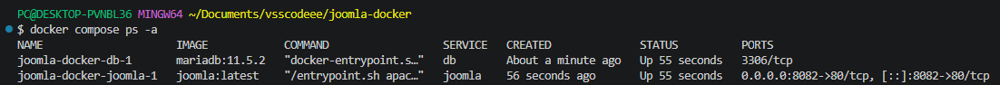

Просмотр логов **Joomla**
```shell
docker compose logs -f joomla
```

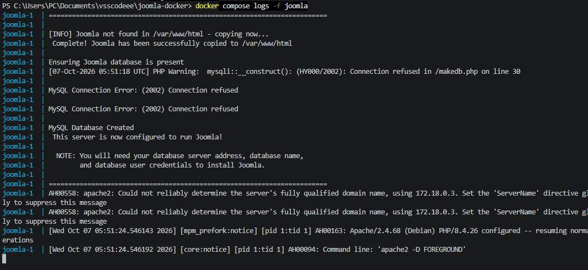

Проверьте логи **MySQL**
```shell
docker compose logs db
```

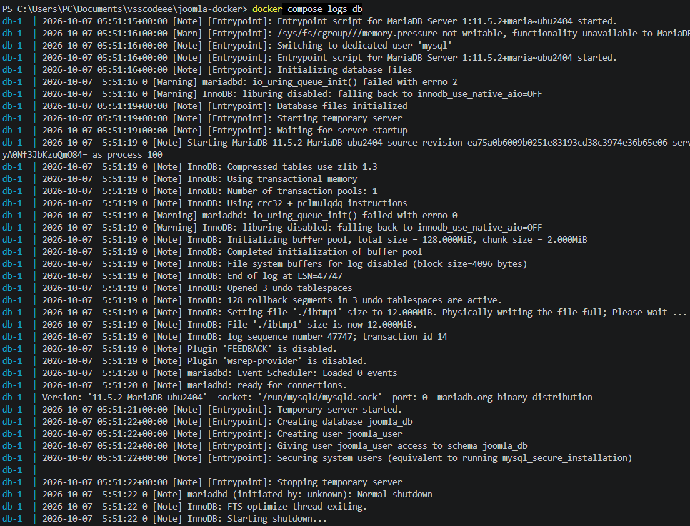

Проверьте сеть (опционально)
```shell
docker network inspect joomla-docker_joomla-network
```

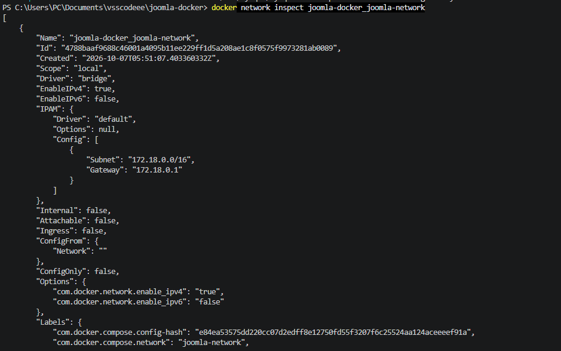

### 4. Процесс установки **Joomla**

Выполнить установку **Joomla** через веб-установщик

[Запустите веб-установщик Joomla, открыв в браузере адрес: http://localhost:8082](http://localhost:8082)

Вы перейдёте на стандартную страницу мастера установки **Joomla**. Вас попросят выполнить несколько шагов:
- Выбор языка установщика (например, `Русский` или `English`) - у меня русский не установился!
- Проверка предустановки: установщик проверит, что серверное окружение соответствует требованиям **Joomla**. Всё должно быть зелёным.
- Настройка базы данных:
  - Тип базы данных: `MySQLi` или `PDO MySQL` (подойдёт любой).
  - Имя сервера баз данных: `db` (это имя сервиса из нашего `compose.yml` файла).
  - Имя пользователя: `joomla_user`
  - Пароль к БД: `joomla_password`
  - Имя базы данных: `joomla_db`

Префикс таблиц: можно оставить по умолчанию или изменить для безопасности.

Настройка веб-сайта:
- Название сайта: придумайте любое название.
- Ваш E-mail: укажите свой email.
- Имя администратора: придумайте имя пользователя для входа в админ-панель.
- Пароль администратора: надёжный пароль.

Установка: после ввода всех данных нажмите **"Установить"**. Joomla создаст все необходимые таблицы в базе данных и завершит настройку.

После завершения вы увидите окно с вашими данными администратора. Для продолжения работы удалите папку `installation`, следуя Важному примечанию на экране установщика.

Теперь ваш сайт доступен по адресам:
- [Joomla сайт: http://localhost:8082](http://localhost:8082)
- [Админ-панель — по адресу http://localhost:8082/administrator](http://localhost:8082/administrator).

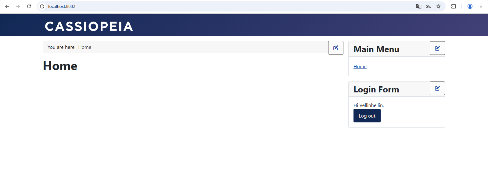

### 5. Управление и полезные команды

Находясь в папке`joomla-docker`

1. Просмотр логов приложения **WP** в реальном времени
```shell
docker compose logs -f joomla
```

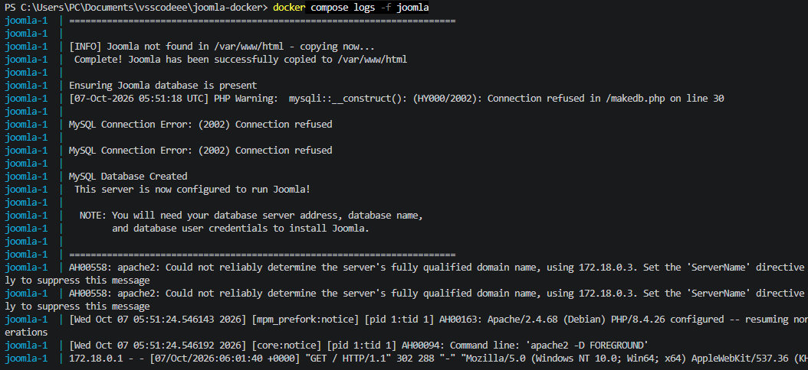

`-f` в режиме ожидания (в режиме реального времени)

Чтобы выйти из режима просмотра логов, необходимо выполнить `Ctrl+C` в терминале

2. Просмотр логов базы данных **db** в реальном времени
```shell
docker compose logs -f db
```

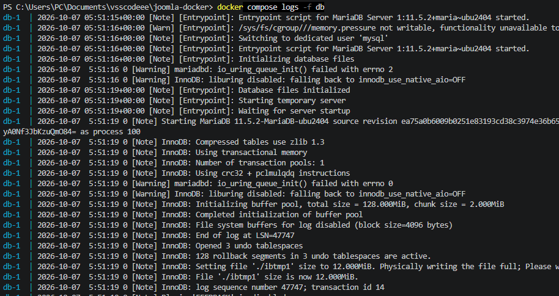

Чтобы выйти из режима просмотра логов, необходимо выполнить `Ctrl+C` в терминале

3. Приостановить запущенный контейнер:
```shell
docker compose stop
```

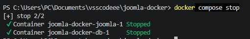

4. Запустить приостановленный контейнер:
```shell
docker compose start
```

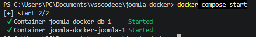

5. Перезапустить
```shell
docker compose restart
```

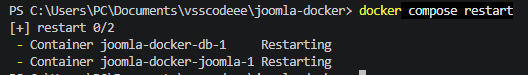

6. Показать конфигурацию текущего проекта:
```shell
docker compose config
```

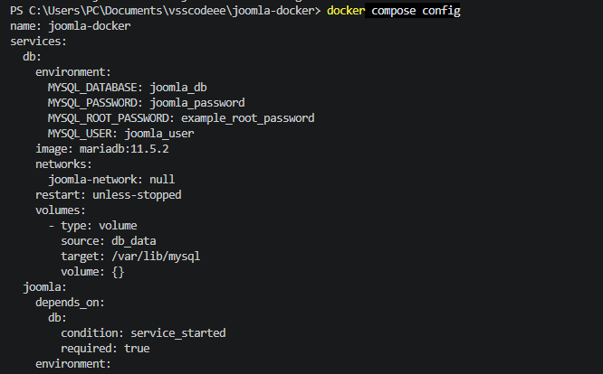

### 6. Удалить композер проекта

Переходим в папку проекта
```shell
cd joomla-docker
```
Останавливаем и удаляем контейнеры и **volumes**
```shell
docker compose down --volumes
```

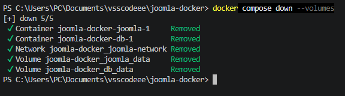

```shell
docker compose down -v
```
Выходим из каталога проекта
```shell
cd ..
```
Удаляем папку проекта через `sudo`, если в **Linux**. Для **Windows** без `sudo`
```shell
rm -rf joomla-docker
```

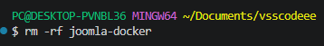


> Если вы обнаружили ошибку в этом тексте - сообщите пожалуйста автору!